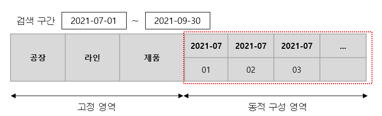
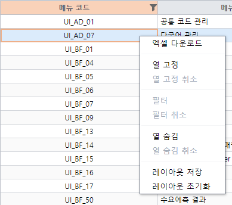

# RealGrid 개발 가이드

<br>

> ## RealGrid version
- 버전에 따라 그리드 생성 방법에 차이가 있습니다.
  - 생략시 **RealGrid2** 로 생성되며, v2.8.0 (2021-10-25 release) 이후부터는 RealGrid2 사용을 권장합니다.
  - version="1" : RealGridJs (http://help.realgrid.com/)
  - version="2" : RealGrid2 (https://docs.realgrid.com/start/overview)
- 버전에 따라 리얼그리드에서 제공하는 API가 상이한 부분이 있으므로 버전에 맞는 문서를 참고해주세요.

<br>

> ## 생성 방법
  - 템플릿 영역에서 그리드가 들어갈 위치에 맞게 삽입합니다.
  - 그리드 id 는 고유한 값으로 설정합니다.
    ```html
      <!--React-->
      let baseGridItems = [
        { name: "username", dataType: "text", headerText: "USER_ID", visible: true, editable: true, validRules: [{ criteria: "required" }] },
        { name: "displayName", dataType: "text", headerText: "USER_NM", visible: true, editable: true, validRules: [{ criteria: "required" }] },
        { name: "uniqueValue", dataType: "text", headerText: "UNIQUE_VALUE", visible: true, editable: true },
        ...
      ];
      ...
      <BaseGrid id="userGrid" items={baseGridItems}></BaseGrid>

      <!--Vue-->
      <div id="gridUser" version="1" style="width: 1310px; height: 750px;"></div>
    ```

  - 그리드 생성 API를 사용하여 그리드를 생성합니다.
    ```javascript
      /*
       * React
       */
      import BaseGrid from 'relative path 입력/component/BaseGrid';
      import ContentContext from 'relative path 입력/ContentContext';
      import {useViewStore} from "../../../../imports";
      
      const [viewData, getViewInfo] = useViewStore(state => [state.viewData, state.getViewInfo]);
      const [userGrid, setUserGrid] = useState(null);
      
      //그리드 생성 및 필드와 컬럼 설정
      useEffect(() => {
        setUserGrid(getViewInfo(vom.active, 'userGrid'))
        ...
      }, [viewData])
      useEffect(() => {
        if (userGrid) {
          setOptions()
        }
      }, [userGrid])

      //옵션 설정
      function setOptions() {
        userGrid.dataProvider.setOptions({ restoreMode: "auto" });
        userGrid.gridView.setFooters({ visible: false });
        userGrid.gridView.setStateBar({ visible: false });
        userGrid.gridView.setCheckBar({ visible: false });
        userGrid.gridView.setDisplayOptions({
          showEmptyMessage: true,
          emptyMessage: transLangKey('MSG_NO_DATA'),
          fitStyle: "evenFill",
          showChangeMarker: false,
          useFocusClass: true
        });
        userGrid.gridView.setEditOptions({
          insertable: true,
          appendable: true
        });
        ...
      }

      /*
       * Vue.js
       */
      //mounted 시 그리드를 생성합니다.
      mounted: function () {
        this.createGrid();
              .
              .
      }
      
      createGrid: function () {
        var gridInfo = this.setColumnsAndFields();
        this.$gridUser = this.$createGrid("gridUser", gridInfo.fields, gridInfo.columns);

        gInitStyle(this.$gridUser);
        gSetOptions(this.$gridUser);
              .
              .
      }
      //columns 설정 시 name과 fieldName 값을 동일하게 설정합니다.
      setColumnsAndFields: function () {
        var fields = [
          { fieldName: 'id' },
              .
              .
        ];
        var columns = [
          {
            name: 'id',
            fieldName: 'id',
            header: { text: transLangKey('ID') },
            editable: false,
            width: 100
          },
              .
              .
        ];

        var obj = {};
        obj.fields = fields;
        obj.columns = columns;
        return obj;
      }
    ```

<br>

> ## 그리드 개인화 적용
  - 그리드 개인화 기능은 컨텍스트 메뉴를 사용하여 적용합니다. <br>
  - 열 고정, 열 숨김, 열 너비, 필터링 상태를 저장할 수 있습니다.<br>
  
    
  - 크로스탭 그리드 적용 범위
    - 크로스탭 그리드를 구성하는 고정 영역에서는 개인화 정보를 적용할 수 있습니다.
    - 동적 구성 영역의 경우는 조회 조건에 따라 헤더 정보가 변하게 되므로 적용이 불가능합니다. 
    
  - 필터링 동작 주의 사항
    - 그리드에 필터링이 설정되어 있을 경우에는 기능 동작의 충돌이 발생되어 컨텍스트 메뉴의 필터링 상태를 저장 할 수 없습니다. <br>

    - 필터링 설정 시 아이템을 체크하지 않은 상태에서 레이아웃을 저장하는 경우에는 레이아웃 로드 시 필터링이 해제됩니다. <br>
  
    - **데이터 변경 사항(행 추가, 삭제, 수정)이 있을 경우 필터링 리스트를 갱신하기 위해서 필터링을 해제 후 다시 설정해주시기 바랍니다.** <br>
    - 자동으로 갱신되도록 처리하기 위해서는 데이터 변경이 발생하는 시점마다의 필터링 리스트를 다시 만들어주는 로직 처리가 필요합니다.
  - 레이아웃 저장 시 메세지 표시 <br>
    
  - 적용 방법 <br>
    초기 마운트 시점에서 아래와 같이 설정합니다.
    ```javascript
      /*
      * React: BaseGrid 내부에서 설정되므로 따로 코딩이 필요 없음.
      */
      

      /*
      * Vue
      */
      mounted: function () {
            .
            .
        saveDefaultLayout(this.$gridUser.gridView, 'gridUser');
        loadGridLayout(this.$gridUser.gridView);
      }


    ```
    컨텍스트메뉴를 적용합니다.
    ```javascript
      /*
      * React: BaseGrid 내부에서 설정되므로 따로 코딩이 필요 없음.
      */
      

      /*
      * Vue
      */
      //그리드 생성 부분에서 그리드를 생성한 뒤 해당 그리드에 공통 개인화 컨텍스트 메뉴를 설정합니다.
      createGrid: function () {
            .
            .
        setGridContextMenu(this.$gridUser.gridView);
      }
    ```

<br>

> ## 엑셀 Export / Import 적용
  - Export
    - 컴포넌트로 설정
      - 템플릿 영역에서 엑셀 버튼이 들어갈 위치에 맞게 삽입합니다.
        ```html
          <!--React-->
          <GridExcelExportButton grid="userGrid" options={exportOptions} /><!--RealGrid2-->

          <!--Vue-->
          <excel-export style="margin-right: 3px;" v-bind="exportSetting"></excel-export>
        ```
        
      - 엑셀 Export 설정 속성 및 Export 그리드를 설정합니다.
        ```javascript
          /*
          * React
          */
          const exportOptions = {
            lookupDisplay: false,
            separateRows: true,
            headerDepth: 2,
            importExceptFields: {0: 'id'},
          };

          /*
          * Vue
          */
          //Vue instance의 data 속성에 exportSetting 을 정의합니다.
          var vm = new Vue({
            el: "#contents",
            i18n: gI18n,
            data: function () {
              return {
                    .
                    .
                exportSetting: {
                  grid: null,
                  headerDepth: 1,
                  footer: "default",
                  allColumns: true,
                  lookupDisplay: true,
                  separateRows: false
                }
              };
            },
                  .
                  .
            //그리드 생성 부분에서 그리드를 생성한 뒤 해당 그리드를 exportSetting 의 grid 로 설정합니다.
            createGrid: function () {
                  .
                  .
              this.exportSetting.grid = Object.freeze(this.$gridUser);
            },
                  .
                  .
          });
        ```

    - 동적 설정
      - 템플릿 영역에서 엑셀 버튼이 들어갈 위치에 맞게 삽입합니다.
        ```html
          <!--React-->
          <button onClick={exportExcel} className="btn btn-outline-secondary my-1">{transLangKey("EXCEL_EXPORT")}</button> <!--RealGrid2-->

          <!--Vue-->
          <excel-export style="margin-right: 3px;" @export="excelExport"></excel-export>
        ```
        
      - 엑셀 Export 설정 속성 및 Export 그리드를 설정합니다.
        ```javascript
          /*
          * React
          */
          function exportExcel () {
            let options = {
              fileName: transLangKey(viewObject.id) + '_' + (new Date()).format('yyyy/MM/dd-HH:mm:ss') + ".xlsx"
            }
            exportGridtoExcel(gridUser.gridView, exportSetting);
          }

          /*
          * Vue
          */
          //Vue instance의 data 속성에 exportSetting 속성을 정의합니다.
          var vm = new Vue({
            el: "#contents",
            i18n: gI18n,
            data: function () {
              return {
                    .
                    .
                exportSetting: {}
              };
            },
                  .
                  .
            excelExport: function () {
              this.exportSetting = {
                headerDepth: 1,
                footer: "default",
                allColumns: false,
                lookupDisplay: true,
                separateRows: true,
                fileName: transLangKey(viewObject.id) + '_' + (new Date()).format('yyyy/MM/dd-HH:mm:ss')
              }
              gExcelExportComponent(this.$gridUser, this.exportSetting);
            },
                  .
                  .
          });
        ```
    - 멀티 시트 설정
      - 템플릿 영역에서 엑셀 버튼이 들어갈 위치에 맞게 삽입합니다.
        ```html
          <!--React-->
          <!--RealGrid2 구현 예정-->
          <!--Vue-->
          <excel-export style="margin-right: 3px;" @export="excelExport"></excel-export>
        ```
        
      - 멀티 시트 엑셀 Export 설정 속성을 설정합니다.
        ```javascript
          /*
          * React
          */
          //구현 예정

          /*
          * Vue
          */
          //Vue instance의 data 속성에 exportSetting 속성을 정의합니다.
          var vm = new Vue({
            el: "#contents",
            i18n: gI18n,
            data: function () {
              return {
                    .
                    .
                exportSetting: {}
              };
            },
                  .
                  .
            //exportGrids 속성은 필수로 지정해야 합니다.
            excelExport: function (grid, MainSub) {
              this.exportSettings = {
                footer: "default",
                allColumns: false,
                lookupDisplay: true,
                separateRows: true, 
                exportGrids: [
                  { grid: this.$gridUser.gridView, sheetName: '시트이름' }
                ]
              }
              exportMultiGridsToExcel(this.exportSettings);
            },
                  .
                  .
          });
        ```
  
  - Import
      - 템플릿 영역에서 엑셀 버튼이 들어갈 위치에 맞게 삽입합니다.
        ```html
          <!--React-->
          <GridExcelImportButton grid="userGrid" />
          <!--Vue-->
          <excel-import @select="onExcelImportSelect" @success="onExcelImportSuccess" @complete="onExcelImportComplete" @error="onExcelImportError" />
        ```
        
      - 엑셀 Import 시 처리할 로직을 구현합니다.
        ```javascript
          /*
          * React
          */
          

          /*
          * Vue
          */
          onExcelImportSelect: function(e) {
            var grid = this.$gridUser.gridView;
            grid.cancel();
            grid.showToast(progressSpinner + "Importing excel data...", true);
          },
          onExcelImportSuccess: function(e) {
            var grid = this.$gridUser.gridView;
            var dataProvider = this.$gridUser.dataProvider;
            //엑셀 업로드 전 기존 data clear
            dataProvider.clearRows();
            //import한 데이터 채우기
            dataProvider.fillJsonData(e.response.RESULT_DATA, { fillMode: "append", count: -1 });
          },
          onExcelImportComplete: function(e) {
            this.$gridUser.gridView.hideToast();
          },
          onExcelImportError: function(e) {
            this.$gridUser.gridView.hideToast();
            console.log(e);
          }
        ```
