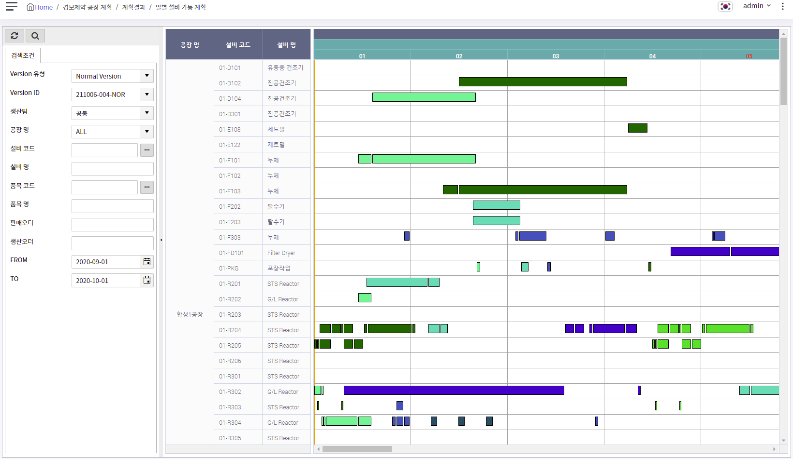

# TreeGrid Gantt 개발 가이드

<br>

> ## 개요

이 문서는 Gantt chart component를 활용한 Web UI 개발 가이드입니다.<br>
Gantt chart component는 TreeGrid Gantt chart를 사용하며, 문서의 내용은 Vue.js framework을 기준으로 합니다.<br>
TreeGrid Gantt chart에 대한 자세한 기능 및 사용 설명은 다음의 링크에서 확인할 수 있습니다.<br>
[TreeGrid Gantt component](https://www.treegrid.com/Gantt)

<br>

> ## 목차

1. [TreeGrid 생성 ](#treegrid-생성)
   - [Template tag 작성 ](#template-tag-작성)
   - [TreeGrid Gantt 생성 ](#treegrid-gantt-생성)
   - [참고 링크 ](#참고-링크)
2. [기본 및 필수 설정 ](#기본-및-필수-설정)
   - [Layout ](#layout)
   - [Data ](#data)
3. [데이터 설정 ](#데이터-설정)
   - [Back-end ](#back-end)
   - [Front-end ](#front-end)
4. [결과 화면](#결과-화면)

<br>

> ## TreeGrid 생성

### Template tag 작성

- TreeGrid Gantt를 생성할 영역에 id 속성을 포함하는 div tag를 작성합니다.

  ```html
  <div id="resourceGantt"></div>
  ```

### TreeGrid Gantt 생성

- mounted 시점에 Layout 설정, Gantt를 생성합니다.<br>
  전체 화면 렌더링 이후에 호출되도록 `$nextTick`으로 감싸줍니다.

  ```javascript
  mounted: function () {
    this.$nextTick(function () {
      this.setGanttLayout(); // Layout 설정
      this.createGanttChart(); // TreeGrid Gantt 생성
    });
  }
  ```

  - Layout 설정

      프로젝트별 js 파일에 아래 [Layout ](#layout) 속성 중 공통 속성을 정의하고, Object를 복사하여 반환하는 함수를 작성합니다.
      ``` javascript
      kbpm.getGanttLayout = function () {
        var ganttLayout = { // 공통 속성
          Cfg: {
            Code: "SGCENBMMYKUUYB",
            Language: localStorage.getItem('countrCode'),
          },
            .
            .
        };
        return JSON.parse(JSON.stringify(ganttLayout));
      }
      ```
      위에서 정의한 공통 Layout을 가져온 후, 추가로 Cols, Header, Action 등 화면별 속성을 설정합니다.
      ``` javascript
      setGanttLayout: function () {
        this.gantt.layout = kbpm.getGanttLayout(); // 공통 Layout 가져오기
        this.gantt.layout.Cols = [ // Cols 설정
          .
          .
        ];
        this.gantt.layout.Header = { // Header 설정
          .
          .
        };
        Object.assign(this.gantt.layout.Actions, { OnRightDragGantt: "DragGanttDependency",
                                                   OnShiftDragGantt: "SelectGanttRunRect" });
                                                   // 여러 속성을 한꺼번에 추가할 때 Object.assign을 사용합니다.
      },

      ```
  - TreeGrid Gantt 생성

      [`createGanttChart`](../../packages/wingui-viewconfig/src/vue/gantt.js) 함수를 호출하여 TreeGrid Gantt를 생성합니다.<br>
      이때, ganttId를 다른 Gantt Object의 id와 겹치지 않도록 고유하게 설정합니다.<br>
      반환받은 TreeGrid Gantt Object를 Vue Instance 변수에 등록하여 사용합니다.
      
      ``` javascript
      createGanttChart: function () {
        // 생성
        this.$gantt = createGanttChart("Gantt", "resourceGantt", this.gantt.tg);
        var ganttId = this.$gantt.id;

        // event 등록
        TGSetEvent("OnClick", ganttId, function (grid, row, col, x, y) {
          // event 내용
        })
      }
      ```

### 참고 링크

- [How to run TreeGrid Vue examples](https://www.treegrid.com/Doc/TreeGridVue.html)
- [Creating TreeGrid](http://www.treegrid.com/Doc/Create.htm)

<br>

> ## 기본 및 필수 설정

- Vue Instance의 data 속성에 Gantt 관련 변수를 "gantt"로 묶어서 지정합니다.<br>
  tg 속성은 `createGanttChart`로 생성할 때 세 번째 인자로 넘겨주는 속성입니다.

  ``` javascript
  gantt: {
    tg: {
      Layout: {Script: "vm.gantt.layout"},
      Data: {Script: "vm.gantt.ganttData"},
      Upload: {Format: "JSON"}
    },
    bodyData: [],
    ganttData: {
      Body: [[ ]]
    },
    layout: {}
  }
  ```

### Layout

- Grid 영역과 Gantt 영역의 구조 및 속성 등을 정의합니다.<br>
  ex) configuration, columns (types, formats, widths, ...), toolbars, control rows, Gantt definition)
- 대표 속성
  | 속성 | 설명 | 비고 |
  |------|-----|-----|
  | Cfg | 기본 그리드 설정 | |
  | Actions | Key, Mouse action 정의 | |
  | Cols | 왼쪽과 오른쪽 사이 가변 열 | 그리드 영역의 컬럼 설정 |
  | LeftCols | 왼쪽에 고정된 열 | 그리드 영역의 컬럼 설정 |
  | RightCols | 오른쪽에 고정된 열 | Gantt 영역 설정 |
  | Header | 그리드 영역의 헤더 | 그리드 영역 컬럼의 헤더 설정 |

  ```javascript
  layout: {
    Cfg: {
      Code: "SGCENBMMYKUUYB", //license code
      id: "Gantt", // TreeGrid id
      Language: localStorage.getItem('countryCode'),
      Style: "TC", // TreeGrid 스타일, 기본값: Standard(TS)
      GanttStyle: "GC", // Gantt Chart 스타일, 기본값: White(GW)
      FastGantt: "1", // 1로 설정 시 run box의 렌더링 속도 증가
      DateStrings: "yyyy-MM-dd HH:mm:ss", // 데이터의 날짜 형식
      LeftWidth: "0", MidWidth: "949", RightWidth: "808", // Cols(Left,Middle,Right)의 너비 설정
      MinLeftWidth: "0", MinMidWidth: "1", MinRightWidth: "0",
      ConstHeight: "1", // 1로 설정 시 main tag(div) 높이를 그리드가 꽉 채움
    },
    Actions: {
      OnClickGantt: "DeselectGanttRunAll, SelectGanttRun", // Gantt select event 설정
      OnDragGantt: "0" // Gantt Run box drag event 설정
    },
    Toolbar: {
      Visible: "0"
    },
    Panel: {
      Visible: "0"
    },
    LeftCols: [],
    Cols: [
      {Name: "id", Type: "Text", Width: "100", Visible: "0"},
      {Name: "plntNm", Type: "Text", Width: "100", Align: "Center", CanEdit: "2", Spanned: "1"},
      {Name: "resCd", Type: "Text", Width: "100",  Align: "Left", CanEdit: "2"},
      {Name: "resNm", Type: "Text", Width: "100", Align: "Left", CanEdit: "2"},
      {Name: "RUN", Type: "Text", Width: "450", Visible: "0"} // Gantt에서 run data가 들어갈 column
    ],
    Header: {
      plntNm: transLangKey("KBPM_PLNT_NM"),
      resCd: transLangKey("KBPM_RES_CD"),
      resNm: transLangKey("KBPM_RES_NM"),
      Align: "Center"
    },
    RightCols: [
      {
        Name: "GANTT",
        Type: "Gantt",

        // Gantt Base/Finish Line 변경 가능 여부 설정
        GanttBaseCanEdit: "0",
        GanttFinishCanEdit: "0",

        // Gantt에 표시되는 기본 단위 시간
        GanttUnits: "d",

        // Gantt Run bar 설정
        GanttRun: "RUN", // run data가 들어갈 column 이름(Cols에 RUN으로 지정)
        GanttRunHeight: "20", // run box의 높이

        // Gantt Header 설정
        GanttHeader1: "y#yyyy", // 첫 번째 헤더 날짜 형식
        GanttHeader2: "M#MM", // 두 번째 헤더 날짜 형식
        GanttHeader3: "d#%dd",// 세 번재 헤더 날자 형식
        GanttHeaderHeight1: "10", // 헤더 높이
        GanttHeaderHeight2: "10",
        GanttHeaderHeight3: "10",

        // Gantt 배경 설정
        GanttBackground: "12/9/1999~12/9/1999#11;" +
                          "12/14/1999~12/14/1999#11;"+
                          "d#1/1/2000#4;" +
                          "12/9/1999~12/9/1999#Black;" +
                          "12/14/1999~12/14/1999#Black;"
                          // 해당 내용으로 설정 시 수직선 표시
      }
    ]
  }
  ```

### Data

- grid, Gantt 데이터는 반드시 아래와 같이 이중 배열의 구조로 정의되어야 합니다.

  ```javascript
  ganttData: {
    Body: [[ ]]
  },
  ```

<br>

> ## 데이터 설정

### Back-end

- response class 구조

  ```java
  @Data
  @Builder
  public class KBPMMonthResPlanRst01Result {

      // row 별로 가지고 있어야 하는 data
      private String plntCd;
      private String plntNm;
      private String resCd;
      private String resNm;
      // GanttInfo를 List 형식으로 포함
      private List<GanttInfo> ganttInfo;

      // run box 별로 가지고 있어야 하는 data
      @Data
      @Builder
      public static class GanttInfo {
          private String backgColor;
          private String fontColor;
          private String brdrColor;
          private Timestamp startDate;
          private Timestamp endDate;
      }

  }
  ```

- service단 가공 과정

  crosstab 데이터 가공 과정과 유사하며(grouping 등..) row, run box 별로 갖고 있어야 할 데이터를 구분하여 설정합니다.

  ```java
  @Service
  @AllArgsConstructor
  public class KBPMMonthResPlanRstService {

      private final QueryHandler queryHandler;

      @SuppressWarnings("unchecked")
      public List<KBPMMonthResPlanRst01Result> getGanttData(...) {

          List<KBPMMonthResPlanRst01Result> data = new ArrayList<>();
          List<KBPMMonthResPlanRst01> result = ... // procedure 호출

          Function<KBPMMonthResPlanRst01, List<Object>> groupColumns = ...// grouping column 추출
          Collection<List<KBPMMonthResPlanRst01>> groupedList = ... // grouping

          for (List<KBPMMonthResPlanRst01> groupItem : groupedList) {
              List<KBPMMonthResPlanRst01Result.GanttInfo> ganttInfoList = new ArrayList<>();
              for (KBPMMonthResPlanRst01 item : groupItem) {
                  // run box 데이터 생성
                  ganttInfoList.add(KBPMMonthResPlanRst01Result.GanttInfo.builder()
                              .backgColor(item.getColCd())
                              .startDate(item.getPlnStrtDte())
                              .endDate(item.getPlnEndDte()).build());
              }
              // row 데이터 생성
              data.add(KBPMMonthResPlanRst01Result.builder()
                  .plntCd(groupItem.get(0).getPlntCd())
                  .plntNm(groupItem.get(0).getPlntNm())
                  .resCd(groupItem.get(0).getResCd())
                  .resNm(groupItem.get(0).getResNm())
                  .ganttInfo(ganttInfoList).build());
          }

          return data;
      }
  }
  ```
  > **response class 구조와 service단 가공 과정은 필수로 따라야 할 규칙이 아닌 일반적으로 사용되는 방법이기 때문에<br>필요에 따라 자유롭게 작성할 수 있습니다.**

- 최종 response data (json)

  ```jsonc
  [
    {
      "plntCd": "P01",
      "plntNm": "합성1공장",
      "resCd": "01-D101",
      "resNm": "유동층 건조기",
      "ganttInfo": [{
        "backgColor": "#02D8B8",
        "fontColor": null,
        "brdrColor": null,
        "startDate": "2020-09-06T01:23:00.000+00:00",
        "endDate": "2020-09-11T01:23:00.000+00:00"
      },
      {
        "backgColor": "#023967",
        "fontColor": null,
        "brdrColor": null,
        "startDate": "2020-09-12T03:12:00.000+00:00",
        "endDate": "2020-09-12T15:12:00.000+00:00"
      }]
    },
        .
        .
  ]
  ```

### Front-end

- 받아온 데이터로 `runData`(RUN)를 생성, 설정한 후 새로 그려지도록 `Reload`를 호출합니다.

  ```javascript
  loadGanttData: function () {
    var fromDate = this.fromDate.format("yyyy-MM-dd");
    var toDate = this.toDate.format("yyyy-MM-dd");

    axios.get(BASE_URL + "month-res-plan-rst/gantt", {
      params: { RSN_ID: this.vrsnId, PLNT_CD: this.plntCd },
    })
    .then(function (response) {
        if (response.status === gHttpStatus.SUCCESS) {
          vm.gantt.bodyData = [];
          var responseData = response.data;

          // row(행 데이터) loop
          responseData.forEach(function (row, idx) {
            var runData = [];
            row.id = idx + 1;
            // ganttInfo(run box 데이터) loop
            row.ganttInfo.forEach(function (dataOfGantt, idxOfGantt) {
              var runBox = {};
              // run box의 id, Start, End 필수 지정
              runBox.id = idxOfGantt + 1;
              runBox.Start = new Date(dataOfGantt.startDate).format("yyyy-MM-dd HH:mm:ss");
              runBox.End = new Date(dataOfGantt.endDate).format("yyyy-MM-dd HH:mm:ss");
              runData.push(runBox);
            })
            // row의 "RUN"에 runData 설정
            row.RUN = JSON.stringify(runData);
          });

          vm.gantt.bodyData.push(responseData);

          Vue.set(vm.gantt.ganttData, "Body", vm.gantt.bodyData); // vm.gantt.ganttData.Body에 데이터 설정
          Vue.set(vm.gantt.layout.RightCols[0], "GanttBase", fromDate); // 시작 일, 종료 일 동적 설정
          Vue.set(vm.gantt.layout.RightCols[0], "GanttFinish", toDate);
        }
      }).catch(function (err) {
        console.warn(err);
      }).then(function () {
        // grid, Gantt가 새로 그려지도록 Reload
        vm.$gantt.Reload();
      });
  }
  ```

- Gantt 영역 초기화

  두 가지 방식 중 상황에 맞게 적절한 api를 사용하여 초기화합니다. ([api 참고](http://www.treegrid.com/Doc/Create.htm#Reloading))
  ``` javascript
  // 방식1 - 데이터, 시작/끝 일자 초기화 + re-render
  Vue.set(this.gantt.ganttData, "Body", [[]]);
  Vue.set(this.gantt.layout.RightCols[0], "GanttBase", "");
  Vue.set(this.gantt.layout.RightCols[0], "GanttFinish", "");
  Vue.delete(this.gantt.layout.RightCols[0], "GanttChartMinStart");
  Vue.delete(this.gantt.layout.RightCols[0], "GanttChartMaxEnd");
  Vue.delete(this.gantt.layout.RightCols[0], "GanttChartMaxStart");
  Vue.delete(this.gantt.layout.RightCols[0], "GanttChartMinEnd");
  this.$gantt.Reload();
  // 방식2 - Gantt Body 행 제거
  this.$gantt.ClearBody();
  ```

<br>

> ## 결과 화면

- 아래 이미지는 위 가이드 예제의 결과 화면입니다.

  전체 코드는 **P016_KBPM_01** branch의 **일별 설비 가동계획**(UI_KB_FP_PR_MONTH_RES_PLAN_RST_01) 화면 폴더에서 확인할 수 있습니다.

  
